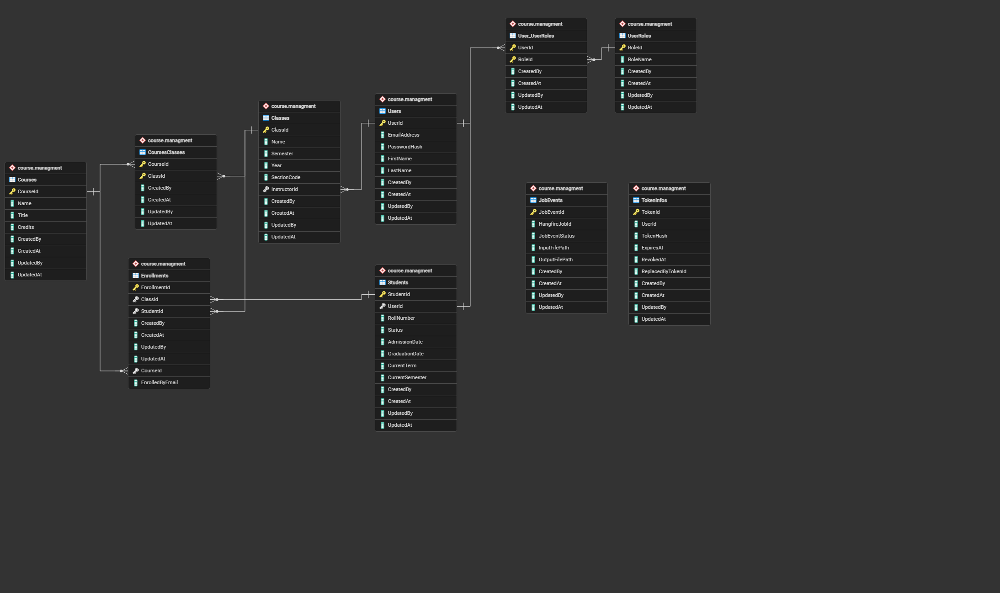

# Course Management Service

This project follows layer architecture. It contains five .NET 9 projects and the startup project is `CourseManagement.API`.

*  `Role based JWT` for authentication and authorization. 
* `postgres` is used as primary database, and `Entity Framework` as ORM.
* `Serilog` is used for structured logging.
* `Hangfire` is used for background processing.

## Run

Requires Docker.

```bash
docker compose -f docker-compose.yml up --build
```

* API Server starts at  `http://localhost:8080`
* PostgreSQL internal Docker network only 
* Migrations and seed data run on startup.
* Seed data (**Roles.json**, **Users.json**) currently contains one admin user (`pias.roy@admin.com`).
* Modify **Users.json** under **CourseManagement.API** project to add custom users on startup.

## Login

`POST /api/v1/Account/login`

```json
{
  "email": "pias.roy@admin.com",
  "password": "password12345678"
}
```

Use the returned `accessToken` as `Authorization: Bearer <token>` on all other requests.

Admin and Staff can manage courses, classes, students, and enrollments. Students can view their own courses, classes, and classmates.

Register users via `POST /api/v1/Account/register` (Admin/Staff). Then create a student record with `POST /api/v1/Student`.


## Postman

Import `CourseManagement.postman_collection.json`. Set collection variable `URL` to `http://localhost:8080`. Also set other variables as per requirement.

## ERD



Source: `Postgres_ERD.pgerd`

## Tests

```bash
dotnet test
```

* Runs all the tests present under project **CourseManagement.UnitTests**

## API Documentation

When running the API in the Development environment, interactive API documentation is available through Scalar:

- Scalar UI: `http://localhost:8080/scalar`
- OpenAPI document: `http://localhost:8080/openapi/v1.json`

The Postman collection is also included in the repository for testing authenticated requests.

## API Endpoints

All endpoints use the `api/v1` prefix.

### Account

| Method | Endpoint | Description |
|---|---|---|
| `POST` | `/api/v1/Account/login` | Authenticate a user |
| `POST` | `/api/v1/Account/refresh-token` | Refresh an access token |
| `GET` | `/api/v1/Account` | List users |
| `GET` | `/api/v1/Account/{id}` | Get a user by ID |
| `POST` | `/api/v1/Account/register` | Register a user |
| `PATCH` | `/api/v1/Account/update-user` | Update the current user |
| `POST` | `/api/v1/Account/change-password` | Change the current user's password |
| `POST` | `/api/v1/Account/change-roles` | Change user roles |
| `DELETE` | `/api/v1/Account/delete-user` | Delete a user |
| `POST` | `/api/v1/Account/revoke-refresh-tokens` | Revoke a user's refresh tokens |

### Courses

| Method | Endpoint | Description |
|---|---|---|
| `GET` | `/api/v1/Course` | List courses |
| `GET` | `/api/v1/Course/{courseId}` | Get a course by ID |
| `GET` | `/api/v1/Course/course-name/{courseName}` | Find a course by name |
| `GET` | `/api/v1/Course/{courseId}/students` | List students enrolled in a course |
| `GET` | `/api/v1/Course/{courseId}/classes` | List classes associated with a course |
| `POST` | `/api/v1/Course` | Create a course |
| `PATCH` | `/api/v1/Course/{courseId}` | Update a course |
| `DELETE` | `/api/v1/Course` | Delete a course |

### Classes

| Method | Endpoint | Description |
|---|---|---|
| `GET` | `/api/v1/Class` | List classes |
| `GET` | `/api/v1/Class/{classId}` | Get a class by ID |
| `GET` | `/api/v1/Class/class-name/{className}` | Find a class by name |
| `GET` | `/api/v1/Class/instructor-email/{email}` | List classes assigned to an instructor |
| `GET` | `/api/v1/Class/{classId}/students` | List students in a class |
| `GET` | `/api/v1/Class/{classId}/courses` | List courses associated with a class |
| `POST` | `/api/v1/Class` | Create a class |
| `PATCH` | `/api/v1/Class/{classId}` | Update a class |
| `DELETE` | `/api/v1/Class` | Delete a class |

### Students

| Method | Endpoint | Description |
|---|---|---|
| `GET` | `/api/v1/Student` | List students |
| `GET` | `/api/v1/Student/{studentId}` | Get a student by ID |
| `GET` | `/api/v1/Student/roll-number/{rollNumber}` | Find a student by roll number |
| `GET` | `/api/v1/Student/classes` | Get the current student's classes |
| `GET` | `/api/v1/Student/courses` | Get the current student's courses |
| `GET` | `/api/v1/Student/classmates` | Get the current student's classmates |
| `GET` | `/api/v1/Student/coursemates` | Get the current student's coursemates |
| `POST` | `/api/v1/Student` | Create a student record |
| `PATCH` | `/api/v1/Student/{studentId}` | Update a student |
| `DELETE` | `/api/v1/Student` | Delete a student |

### Enrollments

| Method | Endpoint | Description |
|---|---|---|
| `GET` | `/api/v1/Enrollment` | List enrollments |
| `GET` | `/api/v1/Enrollment/{id}` | Get an enrollment by ID |
| `GET` | `/api/v1/Enrollment/student-enrollment/{studentId}` | List a student's enrollments |
| `POST` | `/api/v1/Enrollment/class` | Enroll a student in a class |
| `POST` | `/api/v1/Enrollment/course` | Enroll a student in a course |
| `PATCH` | `/api/v1/Enrollment/{id}` | Update an enrollment |
| `DELETE` | `/api/v1/Enrollment` | Delete an enrollment |

### Bulk Imports

| Method | Endpoint | Description |
|---|---|---|
| `POST` | `/api/v1/BulkImports/{importType}` | Upload a CSV for bulk processing |
| `GET` | `/api/v1/BulkImports/status/{jobEventId}` | Check bulk-import status |
| `GET` | `/api/v1/BulkImports/download/{jobEventId}` | Download the bulk-import output file |

## Pagination

The following collection endpoints support pagination through query parameters:

- `GET /api/v1/Account`
- `GET /api/v1/Course`
- `GET /api/v1/Course/{courseId}/students`
- `GET /api/v1/Course/{courseId}/classes`
- `GET /api/v1/Class`
- `GET /api/v1/Class/{classId}/students`
- `GET /api/v1/Class/{classId}/courses`
- `GET /api/v1/Student`
- `GET /api/v1/Student/classmates`
- `GET /api/v1/Student/coursemates`
- `GET /api/v1/Enrollment`

## Dataset Population

Folder **Datasets** contains custom data for users, classes, courses, students and enrollments. Utilize the `BulkImports` endpoints with these CSV files.

* `POST /api/v1/BulkImports/users` with `CourseManagement - Users.csv`
* `POST /api/v1/BulkImports/classes` with `CourseManagement - Classes.csv`
* `POST /api/v1/BulkImports/courses` with `CourseManagement - Courses.csv`
* `POST /api/v1/BulkImports/students` with `CourseManagement - Students.csv`
* `POST /api/v1/BulkImports/enrollments` with `CourseManagement - Enrollments.csv`